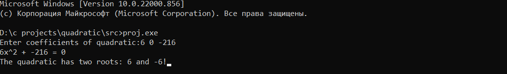
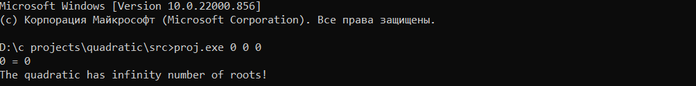
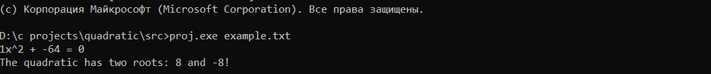

# Quadratic                          

Quadratic is console program that solve quadratic equations.

This project is created by me while I'm lerning C. 

## Download 
You can download source code here.

## Building 
You can build the program using the make utility.

## Usage
You can use the program in 3 difference modes:

1)Run the program and enter 3 coefficients in console.

2)Specify coefficients by command arguments.

3)Enter file name as comand line argument.

# Unit tests
This repository also contains code for unit tests.

You can build it by command: "make test" and them run equations.test.exe file.